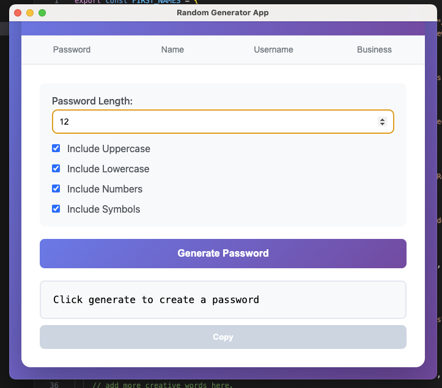
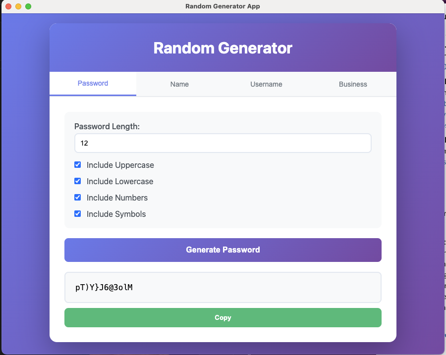
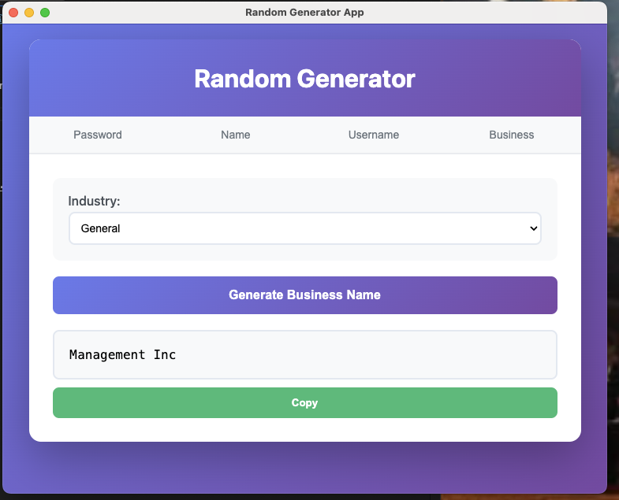
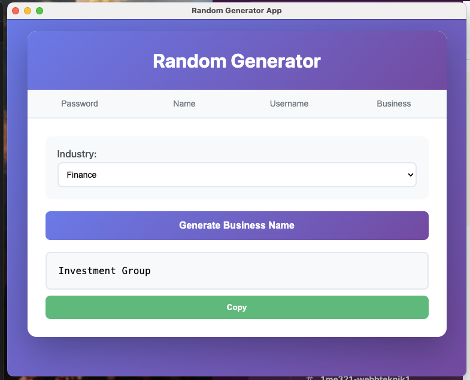
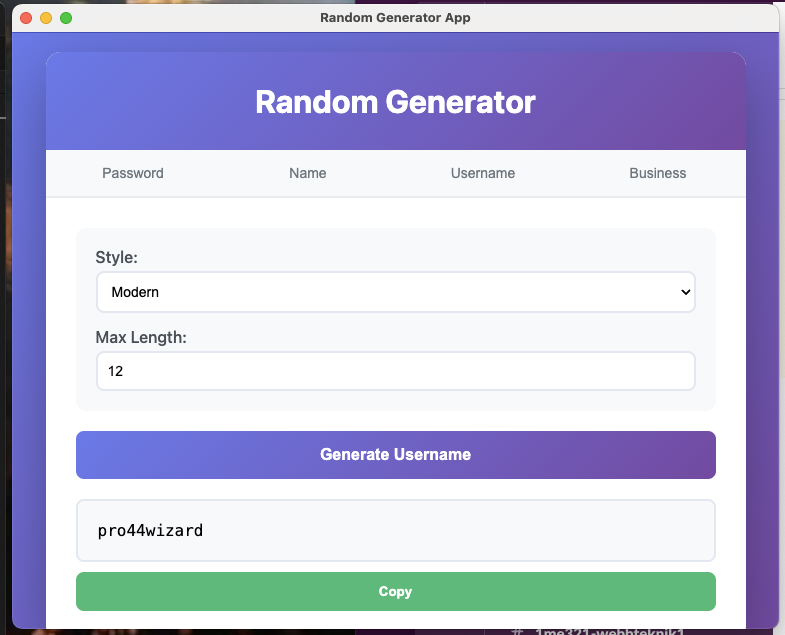

# Random Generator Desktop App

A simple desktop app that generates random passwords, names, usernames, and business names.


,  

 ,  

## Download

Download the latest version:
[GitHub Releases](https://github.com/navee111/L3A-Random--generator/commits/v0.0.1)

### Available versions:
- **macOS**: Download `.dmg` file
- **Windows**: Download `.exe` file  
- **Linux**: Download `.AppImage` file

## Features

- Generate secure passwords with custom options
- Generate random names (first and last)
- Generate usernames in different styles
- Generate business names by industry
- Copy results to clipboard with one click
- Clean, easy-to-use interface

## Installation

1. Download the correct version for your operating system
2. Open the downloaded file and follow the installation instructions
3. Run the app from your applications folder

## Development

### Run the app locally:
```bash
npm install
npm start
```

### Run tests:
```bash
npm test
```

### Build for release:
```bash
npm run build:mac    # macOS
npm run build:win    # Windows
npm run build:linux  # Linux
```

## Testing

This project includes unit tests to make sure everything works correctly.

- **UIController tests**: Test the user interface and error handling
- **AppController tests**: Test the main app logic and IPC communication
- **Mocked dependencies**: Tests use fake versions of Electron and the generator module

Run `npm test` to see all tests pass.

## Clean Code

This project follows Clean Code principles and includes a detailed reflection on how the code was written. The reflection covers. 

- Meaningful names and clear function design
- Proper error handling and testing
- Clean architecture with separated concerns
- Unit testing with Jest

## Technologies Used

- **Electron** - Desktop app framework
- **JavaScript** - Programming language
- **HTML/CSS** - User interface
- **Jest** - Testing framework
- **JSDOM** - DOM testing environment
- **Random Generator Module**(L2) - Core generation logic

## Project Structure

```
src/
├── main/           # Main process (Electron)
│   └── main.js     # App controller and IPC handlers
├── public/         # Renderer process (UI)
│   ├── app.js      # UI controller
│   ├── index.html  # Main HTML file
│   └── style.css   # Styling
test/               # Test files
├── __tests__/      # Jest test files
└── mocks/          # Mock files for testing
```

## License

