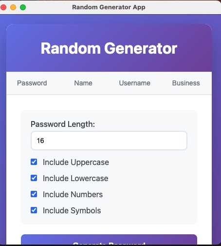

# Requirment Spicifications random generate app

## vision 
Random Generator is made and provide users to generate random data such as password names, usernames, businessnames. all in one place.
It eliminate the need for multiple online tools and makes sure that users can generate strong and unique outputs locally without internet dependency.

## functional requirments

## password generation
**FR1:** The system should generate random passwords based on what users selecting (length, uppercase, lowercase, numbers, and symbols).  
**FR2:** The system should display the generated password instantly in the results area.  
**FR3:** The system should allow users to copy the generated password to the clipboard with one click. 

### name generation 
**FR4:** The system should generate random first and last names based on what users choose from name lists.
**FR5:** The generated name should be displayed in the results area immediately after clicking the “Generate” button.

### username generation 
**FR6:** The system should generate usernames by combining words, numbers, or name fragments.  
**FR7:** The user should be able to copy the generated username to the clipboard. 

### bussiness name generation 
**FR8:** The system should generate creative business names by combining adjectives, nouns, or industry-related words.  
**FR9:** The system should display the generated business name in the results section with animation. 

### general features 
**FR10:** The system should provide a responsive tab-based interface for users to switching between different generators. example below 

**FR11:** The system should include a “Copy” button for each generator.  
**FR12:** The system should visually animate the result box each time new content is generated.  
**FR13:** The system should store no user data, ensuring privacy and local-only functionality.  

## Non Functional Requirements
### Performance
**NFR1:** The app should remain and smooth even when users switching rapidly between tabs.

### Compatibility
**NFR6:** The app should run as a desktop application built with **Electron**, compatible with **Windows, macOS, and Linux**.  
**NFR7:** The app should not require internet access to function.  
**NFR8:** The app should support screen resolutions down to **1366×768** without loss of usability. 

## Constraints
- The app is implemented using **HTML**, **CSS**, and **JavaScript** with **Electron.js** as the runtime framework.  
- All random generation must occur **locally** without external API calls.  
- The design shall follow **Clean Code principles** (small, focused functions, separated logic, grouped related code, etc.).