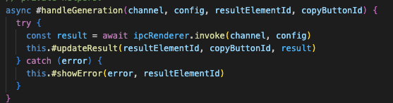
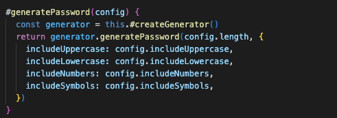

# Reflection 

### chapter 2 Meaningfull Names. 

In this i focused on giving clear and descriptive names to both private and public methods.

For example, in app.js (line 64–89), I used names like **#getPasswordConfig()** and **#getNameConfig().** These describe what the functions returns  configuration objects for password and name generation.

In my app.js line 13–31, i also made a clear distinction between public and private methods — such as generatePassword() (public) vs #handleGeneration() (private).

This made it easier to understand what should be accessed from outside the class and what should stay internal.

A bug in main.js (line 81) where I accidentally wrote Appcontroller instead of AppController reminded me of how crucial consistent naming is. That single typo caused a reference error — a perfect real-life example of why meaningful and consistent names matter.

### chapter 3 Functions 

When it comes to function i amde each function to do one thing. 
for example in my app.js line 46-53 --> , the private method **#handleGeneration()** does exactly one thing. It handles the generation process, including error handling.

I also split related behavior into small helper functions  **#updateResult()** and **#showError()** (line 54–61) — to improve clarity.
A potential conflict is my **#registerEventListeners()** method (line 91–109) which is 18 lines long. According to Clean Code, functions should be small, but in this case I decided it to leaveas it is since it does one conceptual thing. register all the event listeners. Splitting it up would reduce cohesion and makes it harder to see all bindings at once.

In my main.js (line 55–63), I have some repeated generation functions — they could be made DRYer (Don’t Repeat Yourself), but I kept them explicit for clarity during development. // TO DO screenshoot from line 55 - 63 .

