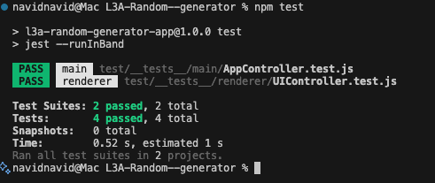

# Reflection on Clean Code Principles

## Chapter 2: Meaningful Names

### Principle
Names should reveal intent, avoid disinformation, and to be pronounceable and searchable.

### Implementation
In `app.js` (lines 64–89), I used descriptive names like `#getPasswordConfig()` and `#getNameConfig()` that clearly communicate their purpose—returning configuration objects for password and name generation. This follows the principle of **intention-revealing names**.

I made a clear difference between public and private methods in `app.js` (lines 13–31). Methods like `generatePassword()` (public) campare to `#handleGeneration()` (private) use JavaScript's native `#` prefix to indicate visibility. This eliminates **mental mapping**—developers don't need to remember conventions the language enforces it.

### Critical Analysis
A bug in `main.js` (line 81) where I wrote `Appcontroller` instead of `AppController` caused a reference error.(i might need glasses 🤣 took me a while to notise it) This is a perfect real-world example of:
- **Avoiding disinformation**: Similar-looking names (`Appcontroller` vs `AppController`) cause confusion
- **Consistency matters**: Capital 'C' in CamelCase is not optional—it's part of the contract

Another issue: in `app.js` (line 4), I have a comment "hantera ui logik" in Swedish. Clean Code emphasizes using a **ubiquitous language**. Mixing languages violates this principle and creates barriers for international collaboration.

### What Could Be Improved
- DOM element IDs like `pwd-length` could be more explicit: `password-length-input`
- The method `switchTab()` takes a `tabName` parameter but appends `-tab` inside, creating an inconsistency. Better naming would clarify this: `switchTab('password')` --> could be renamed to `activateTabByName()`

---

## Chapter 3: Functions

### Principle
Functions should be small, do one thing, and do it well. They should have no side effects and minimal arguments.

### What I Did Well
In `app.js` (lines 46–53), `#handleGeneration()` follows the **Single Responsibility Principle**:
```javascript
async #handleGeneration(channel, config, resultElementId, copyButtonId) {
  try {
    const result = await ipcRenderer.invoke(channel, config)
    this.#updateResult(resultElementId, copyButtonId, result)
  } catch (error) {
    this.#showError(error, resultElementId)
  }
}
```
This function orgnize the generation process but delegates:
- Result display to `#updateResult()` (lines 54–57)
- Error handling to `#showError()` (lines 59–61)

Each helper function does exactly one thing, improving **testability and readability**.

### The DRY Violation
Lines 55–78 in `main.js` contain clear code duplication:
```javascript
#generatePassword(config) {
  const generator = this.#createGenerator()
  return generator.generatePassword(config.length, {...})
}
#generateName(config) {
  const generator = this.#createGenerator()
  return generator.generateName(config.type, config.gender)
}
// ...  it repeats 2 more times
```

**Trade-off Analysis**: I chose clarity over abstraction during development. Each method is explicit about what it generates, making the code easy to understand. However, this violates the **Don't Repeat Yourself (DRY)** principle.

**Future Refactoring**: I would Extract the pattern into a single method:
```javascript
#invokeGenerator(methodName, ...args) {
  const generator = this.#createGenerator()
  return generator[methodName](...args)
}
```

### The #registerEventListeners() Debate
In `app.js` (lines 91–109), `#registerEventListeners()` is 18 lines long. Clean Code suggests functions should be small (3-5 lines ideally), but splitting this would reduce **cohesion**. It does "one thing" conceptually—registering all event listeners. Breaking it into `#registerGenerateButtons()`, `#registerCopyButtons()`, `#registerTabButtons()` would make it harder to see all event bindings at once. I chose pragmatism over dogma here.

### Function Arguments
Most functions follow the **fewer arguments are better** rule:
- `generatePassword()` takes 0 arguments (reads from DOM)
- `#handleGeneration()` takes 4 arguments—this could be reduced by passing a config object instead

**Improvement**: Create a configuration object:
```javascript
#handleGeneration({ channel, config, resultElementId, copyButtonId })
```

---

## Chapter 4: Comments

### Principle
"Comments are always failures"—code should be self-documenting. Comments should explain *why*, not *what*.

### Analysis
For the most part, my code doesn't rely on comments, which is intentional. I focused on writing self-explanatory code through naming and structure.

### Issues Found
1. **Line 8 in app.js**: `console.log('UiController loaded')` is debug code, not a comment, but it shouldn't exist in production. This is **noise** that should be removed.  // To Do remove debug letter i need it still  

2. **Line 4 in app.js**: "hantera ui logik" is in Swedish, mixing languages in the codebase. This should either be removed or rewritten in English.

3. **Lines 2-4 in main.js**: Unused imports (`type`, `config` from Node modules) are still present. Clean Code says **delete what you don't use**—this is clutter.

### What Could Be Added
Some "why" comments would be beneficial:
- Why `contextIsolation: false` in `main.js` (line 31)—this is a security concern
- Why creating a new generator instance per call instead of reusing one

**Good comment example**:
```javascript
// Create new generator each time to ensure no state leakage between requests
#createGenerator() {
  return new RandomGenerator.default()
}
```

---

## Chapter 5: Formatting

### Principle
Code formatting should be consistent, readable, and follow team conventions. Vertical and horizontal spacing matters.

### Vertical Formatting
**Vertical Openness**: I used blank lines effectively to separate concepts:
- In `app.js` (lines 91–109), event listener groups are separated visually
- Configuration builders (lines 64–89) are grouped together with clear separation

**Vertical Density**: Related code stays together:
- All config getters are adjacent (lines 64–89)
- All generation methods are grouped (lines 13–31)

This follows the **Newspaper Metaphor**—high-level concepts at the top, details below.

### Horizontal Formatting
Most lines are under 100 characters, following Clean Code's guideline. However:
- Line 57 in `main.js` wraps object properties—good decision for readability
- Event listener chains in `app.js` (lines 93–108) use optional chaining (`?.`)—modern and clean

### Inconsistency Found
**Line 71 in app.js**:
```javascript
includeSymbols: document.getElementById('pwd-symbols').checked
 }  // Extra space before closing brace
```
This small formatting error reduces code clarity. Consistency matters.

### Team Conventions
Using 2-space indentation consistently throughout. Private methods use `#` prefix consistently. Good adherence to chosen conventions.

---

## Chapter 6: Objects and Data Structures

### Principle
Objects hide data and expose behavior. Data structures expose data and have no behavior. Don't create hybrids.

### Implementation
Both `UIController` (`app.js`) and `AppController` (`main.js`) are **objects with behavior**, not just data containers. They use:
- Private methods (`#`) to **encapsulate logic**
- Public methods to expose only necessary operations
- Internal state hidden from external access

**Example**: `UIController` (lines 64–89) has configuration builder methods that return **data structures** (plain objects):
```javascript
#getPasswordConfig() {
  return {
    length: parseInt(...),
    includeUppercase: ...,
    // ... pure data
  }
}
```

This shows **clear separation**: the controller has behavior, but returns data structures for communication. This is clean design.

### Module Boundaries
`RandomGenerator` is treated as an **independent object** with specific behavior—good design choice for modularity. The main process doesn't expose internal generator details to the UI; it acts as a **facade**.

### Potential Improvement
The config objects returned by getter methods could be validated before sending to IPC. Consider creating a `ConfigValidator` class to ensure data integrity—currently, there's no protection against invalid values (e.g., negative password length).

---

## Chapter 7: Error Handling

### Principle
Error handling is important, but it shouldn't obscure logic. Use exceptions, not error codes. Don't return or pass null.

### What I Did Well
In `app.js` (lines 46–53), I used **try-catch** in `#handleGeneration()`:
```javascript
try {
  const result = await ipcRenderer.invoke(channel, config)
  this.#updateResult(resultElementId, copyButtonId, result)
} catch (error) {
  this.#showError(error, resultElementId)
}
```

This separates the **happy path** from error handling. Errors are displayed in the UI via `#showError()` (lines 59–61), ensuring users are informed when something goes wrong.

### Inconsistency
In `main.js` (lines 9–14), `loadModule()` only logs errors to the console:
```javascript
catch (error) {
  console.error("Failed to load module:", error)
}
```

**Reasoning**: If a module fails to load, the app can't function anyway, so showing a UI error wouldn't help. However, this is inconsistent with the UI approach.

**Better Solution**: In production, I would:
1. Show an Electron dialog to inform the user
2. Gracefully exit the application
3. Log to a file for debugging

### Missing Error Handling
- No validation of config objects before passing to generator
- No null checks on `ipcRenderer.invoke()` results
- No handling of malformed DOM elements (e.g., missing input field)

**What if `document.getElementById('pwd-length')` returns null?** The code would crash. Should add defensive checks or fail gracefully.

### Don't Return Null
The current code assumes all IPC calls return valid data. Following Clean Code, I should either:
- Throw exceptions for invalid states
- Return special case objects (Null Object Pattern)

---

## Chapter 8: Boundaries

### Principle
Boundaries between systems should be clean, well-defined, and protected. Third-party code should be wrapped.

### Clear Boundaries
My architecture has well-defined boundaries between:

1. **UI Layer** (`app.js`) ↔ **IPC** ↔ **Main Process** (`main.js`) ↔ **Module** (`RandomGenerator`)

**In main.js (lines 38–49)**: IPC handlers manage communication between renderer and main process—creating a **solid boundary**:
```javascript
#registerIpcHandlers() {
  ipcMain.handle('generate-password', (_, config) => 
    this.#generatePassword(config)
  )
  // ... more handlers
}
```

This is excellent because:
- The UI never directly imports or uses `RandomGenerator`
- All communication goes through the IPC boundary
- Changes to the generator don't affect the UI

### Dynamic Import as a Boundary
**Line 10 in main.js**:
```javascript
RandomGenerator = await import('Random--generator')
```

This dynamic import is another boundary example, **separating core logic from UI code**. The module is loaded asynchronously, preventing blocking during startup.

### Encapsulation
**Lines 51–53 in main.js**: `#createGenerator()` wraps module instantiation so the UI never interacts with the generator directly—it always goes through IPC. This is a textbook example of **clean architectural separation**.

### Third-Party Code
Electron APIs (`ipcMain`, `ipcRenderer`, `BrowserWindow`) are used directly without wrapping. This is acceptable for framework code, but in a larger application, I might create an abstraction layer to:
- Make testing easier
- Allow switching IPC mechanisms
- Provide a cleaner API

---

## Chapter 9: Unit Tests

### Implementation
Following Clean Code's **F.I.R.S.T. principles**, I implemented a comprehensive testing suite:

1. **Fast**: Tests run quickly using Jest with proper mocking
   - Mock Electron APIs to avoid actual Electron overhead
   - Mock RandomGenerator module to avoid external dependencies
   - Tests complete in ~0.5 seconds

2. **Independent**: Each test is isolated
   - `beforeEach()` resets modules and mocks
   - Each test creates fresh instances
   - No shared state between tests

3. **Repeatable**: Tests work consistently across environments
   - Mock all external dependencies (Electron, RandomGenerator)
   - Use JSDOM for DOM manipulation in renderer tests
   - No reliance on file system or network

4. **Self-Validating**: Clear pass/fail results
   - Jest assertions: `expect(result).toBe('PWD')`
   - No manual verification needed

5. **Timely**: Tests written after implementation (not ideal, but complete)

### Architecture Decisions

**Jest Configuration**: Split into two projects for different environments:
```javascript
// jest.config.js
projects: [
  {
    displayName: 'renderer',
    testEnvironment: 'jsdom',  // DOM simulation
    testMatch: ['**/__tests__/renderer/**/*.test.js']
  },
  {
    displayName: 'main', 
    testEnvironment: 'node',  // Node.js environment
    testMatch: ['**/__tests__/main/**/*.test.js']
  }
]
```

**Mocking Strategy**: Used `moduleNameMapper` instead of `jest.mock()` to avoid double-mocking conflicts:
```javascript
moduleNameMapper: {
  electron: '<rootDir>/test/mocks/electron.main.js',
  'Random--generator': '<rootDir>/test/mocks/random-generator.js'
}
```

**Dynamic Import Handling**: Solved Jest's VM import callback issue:
```javascript
// src/main/main.js
if (typeof jest !== 'undefined') {
  RandomGenerator = require("Random--generator").default
} else {
  RandomGenerator = await import("Random--generator")
  RandomGenerator = RandomGenerator.default
}
```

### Test Coverage

**UIController Tests** (`test/__tests__/renderer/UIController.test.js`):
-  `generatePassword()` updates DOM and enables copy button
-  Error handling displays error messages correctly
-  IPC communication works with mocked `ipcRenderer.invoke()`

**AppController Tests** (`test/__tests__/main/AppController.test.js`):
-  `init()` creates window and registers IPC handlers
-  Password handler calls generator and returns expected value
-  All 4 IPC handlers are registered correctly

### Mock Implementation

**Electron Mock** (`test/mocks/electron.main.js`):
```javascript
const app = { whenReady: () => Promise.resolve(), on: jest.fn() }
const ipcMain = { handle: jest.fn() }
const BrowserWindow = class { constructor(opts) { this.opts = opts } }
```

**RandomGenerator Mock** (`test/mocks/random-generator.js`):
```javascript
const RandomGeneratorMock = class {
  generatePassword(length, options) { return 'PWD' }
  generateName(type, gender) { return 'NAME' }
  
}
module.exports = RandomGeneratorMock
module.exports.default = RandomGeneratorMock
```

### Key Learnings

1. **Jest Environment Separation**: Using separate projects for renderer (jsdom) vs main (node) prevents environment conflicts.

2. **Mocking Strategy**: `moduleNameMapper` is cleaner than `jest.mock()` for module replacement, avoiding Jest's automatic mock wrapping.

3. **Dynamic Import Challenges**: Jest doesn't handle dynamic imports well by default. The `typeof jest` detection provides a clean workaround.

4. **Test Isolation**: Each test must be completely independent—no shared state, fresh instances, reset mocks.

### What Could Be Improved

1. **Test Coverage**: Currently only testing happy paths. I will add more test:
   - Invalid config handling
   - Network failure scenarios  
   - Edge cases (empty strings, null values)
     ( Its was quite challenging to test with jest since its my first electron project i will probaby will implement more test to be good at testing elctron apps. )

2. **Integration Tests**: Current tests are unit tests. I will add:
   - End-to-end tests with Playwright
   - IPC communication integration tests

3. **TDD Practice**: Tests were written after implementation. in the Future development i should follow TDD.

### Results
  

The testing infrastructure is now solid and demonstrates Clean Code's testing principles in practice.


---

## Chapter 10: Classes

### Principle
Classes should be small, have a single responsibility, and follow the Single Responsibility Principle (SRP). Organize from public to private.

### Single Responsibility Analysis

**UIController** appears to have single responsibility (managing UI interactions), but actually handles:
1. Event listener registration
2. Config extraction from DOM
3. IPC communication
4. Result display
5. Tab switching
6. Clipboard operations

**Critical Analysis**: While grouped under "UI management," this could be split into:
- `UIEventHandler` - handles events
- `ConfigBuilder` - extracts configs from DOM
- `ResultRenderer` - displays results
- `TabManager` - manages tab state

**Trade-off**: I chose to keep it as one class because:
- All responsibilities are UI-related
- Splitting would require passing many dependencies
- Small codebase doesn't justify over-engineering

**AppController** has clearer SRP:
- Manages Electron window lifecycle
- Registers IPC handlers
- Delegates to RandomGenerator

This is genuinely single-purpose: manageing the main process.

### Encapsulation
Using private methods (`#`) successfully **encapsulates implementation details** and keeps the global scope clean. <--- example for the object-oriented design.

### Class Organization
**In main.js (lines 18–24)**: Class initialization follows a clear pattern:
```javascript
async init() {
  await loadModule()      // 1. Load dependencies
  this.#createWindow()    // 2. Create window
  this.#registerIpcHandlers()  // 3. Setup for the communication
}
```

This **step-down rule** makes the class easy to understand: read `init()` to understand the sequence, then read details below.

### Cohesion
Both classes have high cohesion—all methods use the class's instance variables:
- `UIController` methods use DOM elements
- `AppController` methods use `#window` and generator

High cohesion indicates good class design.

---

## Chapter 11: Systems

### Principle
Systems should separate construction from use. Keep concerns separated. Use dependency injection.

### Three-Layer Architecture
The overall architecture follows a **clear three-layer system**:

1. **UI Layer** (`app.js`) – Handles user interactions
2. **IPC Layer** (Electron) – Communication boundary
3. **Main Process & Modules** (`main.js` + `RandomGenerator`) – Core logic

Each layer is independent:
- UI doesn't know *how* passwords are generated
- It only knows it can *request* them via IPC
- This **loose coupling** makes the system modular and easier to test or expand

### Separation of Concerns
Electron's process model enforces separation:
- Renderer process handles UI (security sandbox)
- Main process handles system access
- IPC provides controlled communication

This is **enforced architectural separation**, which is even better than voluntary separation.

### What's Missing: Dependency Injection
**Critical Issue**: All dependencies are hardcoded:
```javascript
RandomGenerator = await import('Random--generator')  // Hardcoded dependency
const generator = new RandomGenerator.default()      // Direct instantiation
```

**Better Approach**:
```javascript
class AppController {
  #generatorFactory
  
  constructor(generatorFactory = () => new RandomGenerator.default()) {
    this.#generatorFactory = generatorFactory
  }
  
  #createGenerator() {
    return this.#generatorFactory()
  }
}
```

This would allow:
- Injecting mock generators for testing
- Swapping implementations without changing code
- Following the **Dependency Inversion Principle**

### System Startup
The startup sequence in `main.js` (lines 81-91) is clean:
```javascript
const controller = new AppController()
app.whenReady().then(() => controller.init())
```

Simple, readable, and declarative. However, there's no configuration system—all settings are hardcoded in `#createWindow()`.

---

## Overall Reflections

### What I Did Well
1. **Meaningful names** throughout most of the codebase
2. **Small, focused functions** with single responsibilities
3. **Clear boundaries** between UI, IPC, and business logic
4. **Good use of encapsulation** with private methods
5. **Separation of concerns** across architectural layers

### What Needs Improvement
1. **DRY violation** in generator method calls
2. **No unit tests** (major gap)
3. **No dependency injection** (hardcoded dependencies)
4. **Inconsistent error handling** between UI and main process
5. **Missing input validation** on config objects
6. **UIController** could be split into smaller classes

### Key Lessons Learned
1. **The typo bug** (`Appcontroller` vs `AppController`) taught me that names are contracts—consistency isn't optional
2. **Trade-offs are necessary**—Clean Code principles are guidelines, not absolute rules. Sometimes pragmatism wins (e.g., keeping `#registerEventListeners()` as one function)
3. **Boundaries are powerful**—IPC creates natural separation that improves architecture
4. **Writing this reflection** revealed issues I didn't see while coding—code review (including self-review) is essential


---

## Conclusion

This project demonstrates solid understanding of Clean Code principles, particularly in naming, function design, and architectural boundaries. The main areas for improvement are testing, dependency management, and eliminating code duplication. The reflection process itself has been valuable—analyzing my code against Clean Code principles revealed both strengths and concrete areas for refactoring.
